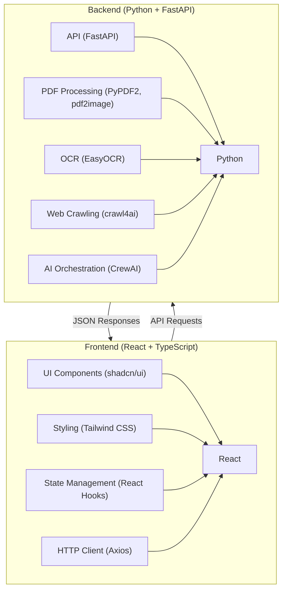

# Research Paper Code Generator

<div align="center">


</div>

A powerful AI-driven application that transforms research papers into working machine learning code. This tool automatically extracts text, formulas, and images from research papers and generates executable code in your preferred ML framework.

<div align="center">


</div>

## 🌟 Features

- **Dual Input Methods**: Process papers via URL or PDF upload
- **Comprehensive Extraction**: Automatically extracts text, mathematical formulas, and images
- **OCR Capabilities**: Extracts text from images within papers
- **Formula Recognition**: Identifies and extracts LaTeX and MathML formulas
- **Multi-Framework Support**: Generates code in PyTorch or TensorFlow
- **Multiple LLM Options**: Works with OpenAI GPT, Anthropic Claude, or Grok AI
- **Intelligent Code Generation**: Uses CrewAI with specialized agents for accurate code generation
- **Fallback Mechanism**: Ensures code generation even if primary method fails

## 🔍 Tech Stack



### Frontend
- **Framework**: React with TypeScript
- **UI Components**: shadcn/ui (Radix UI)
- **Styling**: Tailwind CSS
- **HTTP Client**: Axios
- **Routing**: React Router
- **3D Effects**: Three.js with React Three Fiber

### Backend
- **Framework**: FastAPI
- **PDF Processing**: PyPDF2, pdf2image
- **OCR**: EasyOCR
- **Web Crawling**: crawl4ai
- **AI Orchestration**: CrewAI
- **Image Processing**: Pillow, NumPy

## 🚀 Getting Started

### Prerequisites

- Node.js (v16+)
- Python (v3.8+)
- pip

### Frontend Setup

```bash
# Navigate to the frontend directory
cd research-code-genie

# Install dependencies
npm install

# Start the development server
npm run dev
```

The frontend will be available at http://localhost:5173

### Backend Setup

```bash
# Navigate to the backend directory
cd backend

# Create a virtual environment (optional but recommended)
python -m venv venv

# Activate the virtual environment
# On Windows
venv\Scripts\activate
# On macOS/Linux
source venv/bin/activate

# Install dependencies
pip install -r requirements.txt

# Start the server
uvicorn main:app --host 0.0.0.0 --port 8001 --reload
```

The backend API will be available at http://localhost:8001

## 📚 API Documentation

### `/process_url` Endpoint

**Method**: POST

**Description**: Processes a research paper from a URL

**Request Body**:
```json
{
  "url": "https://arxiv.org/abs/2302.13971",
  "framework": "pytorch",
  "llm": "openai",
  "api_key": "your_api_key_here"
}
```

**Response**:
```json
{
  "text": "Extracted text from the paper...",
  "formulas": ["formula1", "formula2"],
  "image_analysis": [{
    "image": "base64_encoded_image",
    "extracted_text": "Text extracted from image"
  }],
  "code": "Generated Python code..."
}
```

### `/process_pdf` Endpoint

**Method**: POST

**Description**: Processes an uploaded PDF research paper

**Request Body**: `multipart/form-data`
- `file`: PDF file
- `framework`: ML framework (pytorch/tensorflow)
- `llm`: LLM provider (openai/anthropic/grok)
- `api_key`: API key for the selected LLM

**Response**: Same as `/process_url` endpoint

### Example Usage (Python)

```python
import requests

# Process a paper from URL
url_response = requests.post(
    "http://localhost:8001/process_url",
    json={
        "url": "https://arxiv.org/abs/2302.13971",
        "framework": "pytorch",
        "llm": "openai",
        "api_key": "your_api_key_here"
    }
)

# Process a PDF paper
with open('paper.pdf', 'rb') as f:
    pdf_response = requests.post(
        "http://localhost:8001/process_pdf",
        files={"file": f},
        data={
            "framework": "pytorch",
            "llm": "openai",
            "api_key": "your_api_key_here"
        }
    )
```

## 🧠 How It Works

1. **Input Processing**:
   - URL input: The system crawls the webpage and extracts HTML content
   - PDF input: The system extracts text and images from the PDF

2. **Content Extraction**:
   - Text is extracted from the document
   - Mathematical formulas (LaTeX/MathML) are identified and extracted
   - Images are processed with OCR to extract any text they contain

3. **AI Processing**:
   - The system uses CrewAI to orchestrate specialized agents:
     - **Paper Scraper**: Extracts and organizes content from the paper
     - **Content Analyzer**: Analyzes the extracted content to understand the paper's algorithms
     - **Code Generator**: Generates executable code based on the analysis

4. **Fallback Mechanism**:
   - If CrewAI processing fails, a fallback code generator creates basic implementation
   - The fallback adapts based on detected formulas and content type

## 🛠️ Development

### Project Structure

```
├── backend/                  # Backend code
│   ├── main.py               # FastAPI application
│   ├── requirements.txt      # Python dependencies
│   └── utils/                # Utility functions
│       ├── extract_text_from_image.py  # OCR functionality
│       ├── fall_back_code.py           # Fallback code generation
│       └── find_formulas.py            # Formula extraction
│
└── research-code-genie/      # Frontend code
    ├── public/               # Static assets
    ├── src/                  # Source code
    │   ├── components/       # UI components
    │   ├── hooks/            # Custom React hooks
    │   ├── pages/            # Application pages
    │   └── App.tsx           # Main application component
    ├── package.json          # Node.js dependencies
    └── vite.config.ts        # Vite configuration
```

### Adding New Features

1. **New ML Frameworks**:
   - Add new framework option in the frontend select component
   - Implement corresponding code generation in the backend

2. **Supporting New LLMs**:
   - Add new LLM option in the frontend
   - Implement the LLM integration in the backend

## 📄 License

This project is licensed under the MIT License - see the LICENSE file for details.

## 🤝 Contributing

Contributions are welcome! Please feel free to submit a Pull Request.

1. Fork the repository
2. Create your feature branch (`git checkout -b feature/amazing-feature`)
3. Commit your changes (`git commit -m 'Add some amazing feature'`)
4. Push to the branch (`git push origin feature/amazing-feature`)
5. Open a Pull Request

## 📞 Contact

If you have any questions or feedback, please open an issue on this repository.